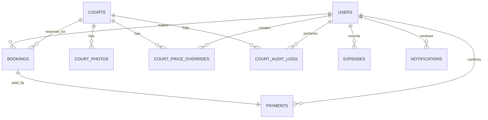

# Product Requirements Document (PRD) & Panduan Teknis Lengkap
## VITKA FUTSAL — Sistem Booking Online

| | |
|---|---|
| **Versi** | 2.0 (Merged & Updated) |
| **Tanggal** | 17 Juni 2026 |
| **Status** | Approved |
| **Dibuat oleh** | Tim Pengembang |
| **Client** | VITKA FUTSAL |

---

## Daftar Isi
1. [Latar Belakang & Tujuan](#1-latar-belakang--tujuan)
2. [Ruang Lingkup](#2-ruang-lingkup)
3. [Pengguna & Role](#3-pengguna--role)
4. [Arsitektur & Tech Stack Sistem](#4-arsitektur--tech-stack-sistem)
5. [Alur Bisnis Utama](#5-alur-bisnis-utama)
6. [Spesifikasi Fitur](#6-spesifikasi-fitur)
7. [Model Data (PostgreSQL)](#7-model-data-postgresql)
8. [Business Rules & Constraint](#8-business-rules--constraint)
9. [Keamanan & Otorisasi](#9-keamanan--otorisasi)
10. [Non-Functional Requirements](#10-non-functional-requirements)
11. [Keputusan Desain Arsitektural](#11-keputusan-desain-arsitektural)
12. [Panduan Visual & Desain (The Verge Style - Light Edition)](#12-panduan-visual--desain-the-verge-style---light-edition)
13. [Integrasi Design System & UI (Tailwind v4 x PrimeVue v4)](#13-integrasi-design-system--ui-tailwind-v4-x-primevue-v4)
14. [Aturan Pengembangan Kode (Development Guidelines)](#14-aturan-pengembangan-kode-development-guidelines)

---

## 1. Latar Belakang & Tujuan

### Latar Belakang
VITKA FUTSAL adalah fasilitas olahraga futsal dengan 1 lokasi yang memiliki beberapa lapangan. Saat ini proses pemesanan lapangan masih dilakukan secara manual (via telepon / chat langsung), yang menyebabkan:
- Risiko double booking (bentrok jadwal sewa).
- Tidak ada rekap pendapatan yang terstruktur, tercampur antara kas langsung dan transfer.
- Kesulitan tracking histori booking oleh pelanggan maupun admin.
- Pengalaman customer yang kurang profesional dan kurang praktis.

### Tujuan Proyek
Membangun sistem booking online yang memungkinkan:
- Customer memesan lapangan secara mandiri, kapan saja (24/7), tanpa perlu menghubungi admin.
- Admin mengelola semua operasional booking, rescheduling, & pembayaran dengan efisien.
- Owner mendapatkan visibilitas penuh atas kinerja bisnis melalui laporan laba-rugi & analitik okupansi.

### Success Metrics
- Nol insiden double booking menggunakan database-level locking.
- Waktu booking customer kurang dari 3 menit.
- Admin dapat mengkonfirmasi pembayaran dalam satu klik.
- Owner dapat mengakses laporan keuangan riil dan mengunduhnya kapan saja.

---

## 2. Ruang Lingkup

### Dalam Lingkup (In-Scope MVP)
- Landing page publik bertema brutalist-editorial yang bersih (*clean*).
- Sistem booking mandiri untuk customer (bisa sebagai *Registered User* maupun *Guest Customer*).
- Halaman pencarian dan pelacakan status booking via Nomor Booking unik untuk Guest.
- Manajemen booking untuk admin (termasuk reschedule, pembatalan, dan input booking manual/walk-in).
- Manajemen keuangan (pencatatan konfirmasi pembayaran manual, refund, dan input biaya pengeluaran operasional/expense).
- Manajemen lapangan untuk admin & owner (pengaturan harga dasar, jam operasional, dan override harga khusus per tanggal).
- Dashboard analitik terpisah untuk Admin dan Owner.
- Manajemen staf admin bersifat read-only untuk Owner.
- Notifikasi in-app real-time berbasis WebSocket (Laravel Reverb).

### Di Luar Lingkup (Out-of-Scope)
- Integrasi payment gateway otomatis (seperti Midtrans/Xendit) — pembayaran diverifikasi manual oleh admin.
- Aplikasi mobile native (Android/iOS) — fokus pada responsive web application.
- Multi-lokasi / multi-tenant.
- Sistem loyalitas, poin reward, atau kupon diskon dinamis.
- Integrasi WhatsApp Gateway / SMS / Email otomatis pihak ketiga.
- Sistem inventaris peralatan futsal (penyewaan sepatu, rompi, dll).

---

## 3. Pengguna & Role

### Hierarki Role
```
Owner  >=  Admin  >=  Customer (Registered)  >=  Customer (Guest)
```

### Matriks Akses

| Fitur | Guest | Customer | Admin | Owner |
|-------|:-----:|:--------:|:-----:|:-----:|
| Lihat landing page | ✅ | ✅ | ✅ | ✅ |
| Booking lapangan | ✅ | ✅ | ✅ | ✅ |
| Cek status booking (via no. booking) | ✅ | — | — | — |
| Lihat history booking pribadi | ❌ | ✅ | — | — |
| Profile management | ❌ | ✅ | ✅ | ✅ |
| Booking management | ❌ | ❌ | ✅ | ✅ |
| Payment & Expense management | ❌ | ❌ | ✅ | ✅ |
| Courts management | ❌ | ❌ | ✅ | ✅ |
| Dashboard analytics | ❌ | ❌ | ✅ | ✅ |
| Laporan keuangan detail (Profit/Loss) | ❌ | ❌ | ❌ | ✅ |
| Staff management (Read-only) | ❌ | ❌ | ❌ | ✅ |

---

## 4. Arsitektur & Tech Stack Sistem

### Tech Stack Utama

| Layer | Teknologi | Keterangan |
|-------|-----------|------------|
| **Backend** | Laravel 12 | PHP 8.3+, arsitektur monolitik modern |
| **Frontend** | Vue.js 3 (Composition API) | Dirender reaktif via Inertia.js |
| **CSS Framework** | TailwindCSS v4 | Konfigurasi CSS-first terintegrasi native di Laravel 12 |
| **UI Component Library** | PrimeVue v4 | Styled mode (Aura Preset) dengan kustomisasi CSS variables |
| **Icon Library** | Lucide Vue Next | Ikon SVG modern, bersih, bergaris tipis (*stroke*) |
| **Animation Library** | GSAP / Motion One | Animasi mikro, transisi bento grid, dan reveal entrance |
| **Database** | PostgreSQL | Manajemen data relasional dan database locking |
| **Real-time** | Laravel Reverb | WebSocket server bawaan Laravel untuk notifikasi lokal |
| **Auth** | Laravel Breeze (Inertia Stack) | Autentikasi berbasis session |
| **Export Engine** | Laravel Excel + DomPDF | Cetak struk sewa (PDF) dan laporan bulanan (Excel) |

### Pola Arsitektur Backend — Service Repository Pattern

Untuk memisahkan logika bisnis dari database query, kita menerapkan Service-Repository Pattern:
```
HTTP Request
    ↓
[Controller]          → Menerima HTTP Request, validasi input, return Inertia/JSON
    ↓
[Service]             → Pemrosesan logika bisnis, database transaction, locking
    ↓
[Repository]          → Abstraksi query database (menggunakan Eloquent ORM)
    ↓
[Model / Database]    → Eloquent Model + PostgreSQL
```

### Pola Arsitektur Frontend — Feature-Based Component Architecture

Komponen Vue ditata berdasarkan fitur (*feature-based*) di dalam folder `resources/js/Features/` untuk mempermudah pengembangan berskala besar:
```
resources/
└── js/
    ├── app.js
    ├── Layouts/              → Shared layouts (PublicLayout, AdminLayout, dll.)
    ├── Pages/                → Halaman view utama yang dipetakan oleh route Inertia
    ├── Features/             → Folder fitur dengan komponen, logic, dan composable terkolokasi
    │   ├── booking/          → Fitur booking (BookingCalendar.vue, SlotGrid.vue, dll.)
    │   ├── payment/          → Fitur pembayaran & biaya (ExpenseForm.vue, dll.)
    │   ├── courts/           → Fitur manajemen lapangan
    │   ├── dashboard/        → Fitur visualisasi & charts
    │   └── notifications/    → Fitur real-time notifications
    └── Components/           → Komponen UI global (AppButton.vue, StatusBadge.vue, dll.)
```

---

## 5. Alur Bisnis Utama

### 5.1 Alur Booking Customer (Registered / Login)
```
Landing Page ➔ Klik "Book Now" 
             ➔ Pilih Lapangan & Tanggal di Kalender
             ➔ Pilih Slot Waktu Tetap (Fixed Slots) di Grid (Hijau = Tersedia)
             ➔ Isi Nama & No. HP (Terisi otomatis jika login)
             ➔ Submit ➔ Sistem mengunci database (Advisory Lock + SELECT FOR UPDATE)
             ➔ Jika slot aman ➔ Simpan booking ➔ Status Confirmed 
             ➔ Notifikasi real-time terkirim ke Admin & Customer
             ➔ Customer datang ke lokasi ➔ Bayar manual (Cash/Transfer/QRIS)
             ➔ Admin memverifikasi pembayaran di sistem ➔ Status Completed 
             ➔ Laporan keuangan ter-update otomatis
```

### 5.2 Alur Booking Guest
Sama seperti alur customer terdaftar, namun setelah booking berstatus **Confirmed**, sistem menampilkan **Nomor Booking unik (VF-XXXXXX)**. Guest dapat melacak status pembayaran dan waktu sewa mereka secara publik melalui menu "Cek Booking Saya".

### 5.3 Alur Booking Manual (Walk-in) oleh Admin
Admin masuk ke panel Admin ➔ Menu Booking Management ➔ "Tambah Booking Manual" ➔ Isi data pelanggan, lapangan, tanggal, dan slot ➔ Submit (sistem tetap menerapkan locking pengecekan bentrok) ➔ Status langsung **Confirmed**.

### 5.4 Alur Reschedule (Hanya Admin)
Admin memilih pesanan aktif berstatus `Confirmed` ➔ Klik "Reschedule" ➔ Pilih tanggal/slot baru ➔ Sistem memvalidasi ketersediaan slot baru ➔ Konfirmasi ➔ Jadwal berubah, notifikasi terkirim ke customer.

---

## 6. Spesifikasi Fitur

### F-01: Landing Pagepublik
- **Hero Section**: Judul besar bertema brutalist (Oswald font), CTA utama "Pesan Lapangan", dan CTA sekunder "Lacak Booking".
- **Card Lapangan**: List lapangan lengkap dengan tipe (indoor/outdoor), harga dasar per slot, status hari ini, galeri foto, dan tombol "Book Now".
- **Testimonis**: Menampilkan ulasan pelanggan yang dikelola manual oleh admin.
- **Footer**: Kontak operasional, alamat lengkap, peta (embed Google Maps), dan link media sosial.

### F-02: Sistem Booking & Kalender Reaktif
- Pemilihan tanggal interaktif menggunakan PrimeVue Calendar.
- Tampilan grid slot waktu tetap (*fixed slots*) berdurasi 60 menit per slot.
- Transisi grid yang halus menggunakan GSAP saat perpindahan tanggal.

### F-03: Pelacakan Booking Guest
- Input pencarian: Nomor Booking (VF-XXXXXX).
- Tampilan detail: nama lapangan, tanggal sewa, jam mulai-selesai, total harga, status booking (`Confirmed` / `Completed` / `Cancelled`), dan catatan instruksi pembayaran di lokasi.

### F-04: Panel Booking Management (Admin)
- Datatable pencarian booking dengan filter tanggal, status, dan pencarian nama/nomor HP.
- Tombol pembatalan booking (wajib memasukkan alasan pembatalan minimal 10 karakter).
- Antarmuka reschedule pemindahan slot sewa.

### F-05: Manajemen Keuangan (Admin & Owner)
- Verifikasi pembayaran manual dengan memilih metode pembayaran (`cash`, `transfer`, `qris`).
- Penginputan pengeluaran operasional (`expenses`) dengan kategori (`utilities`, `maintenance`, `salaries`, `other`), deskripsi, jumlah nominal, dan tanggal.
- Laporan Keuangan Laba-Rugi: Total Pendapatan - Total Pengeluaran = Laba Bersih (*Net Profit*).
- Unduh Laporan Keuangan dalam format PDF (struk sewa) dan Excel (laporan keuangan bulanan).

### F-06: Manajemen Lapangan (Courts Management)
- CRUD data lapangan: nama, tipe, harga sewa dasar, jam buka-tutup, dan galeri foto.
- Fitur **Price Override**: Pengaturan harga sewa khusus untuk tanggal tertentu (misalnya menaikkan harga pada akhir pekan atau libur nasional).
- **Audit Log**: Mencatat perubahan data lapangan (siapa staf yang mengubah, kapan, kolom apa, nilai lama, dan nilai baru).

### F-07: Executive Dashboard
- **Dashboard Admin**: Berisi informasi ringkasan hari ini (total booking aktif, okupansi lapangan, breakdown metode bayar, dan notifikasi terbaru).
- **Dashboard Owner**: Menampilkan grafik visual laba bersih bulanan (line chart), analisis pengeluaran (donut chart), okupansi lapangan, serta akses ekspor data keuangan.

---

## 7. Model Data (PostgreSQL)

### Diagram Hubungan Entitas (Mermaid ERD)


### Kamus Data Tabel Database

#### 1. Tabel: `users`
- `id` (BIGINT, PK, Auto Increment)
- `name` (VARCHAR(255), NOT NULL)
- `email` (VARCHAR(255), UNIQUE, NOT NULL)
- `phone` (VARCHAR(20), NULL)
- `password` (VARCHAR(255), NOT NULL)
- `role` (VARCHAR(20), DEFAULT 'customer') ➔ 'owner', 'admin', 'customer'
- `photo` (VARCHAR(255), NULL)
- `is_active` (BOOLEAN, DEFAULT true)
- `remember_token` (VARCHAR(100), NULL)
- `created_at` / `updated_at` (TIMESTAMP)

#### 2. Tabel: `courts`
- `id` (BIGINT, PK, Auto Increment)
- `name` (VARCHAR(255), NOT NULL)
- `type` (VARCHAR(20), NOT NULL) ➔ 'indoor', 'outdoor'
- `price` (DECIMAL(12,2), NOT NULL) ➔ harga dasar per slot
- `slot_duration` (INTEGER, NOT NULL) ➔ durasi dalam menit (default: 60)
- `open_time` (TIME, NOT NULL)
- `close_time` (TIME, NOT NULL)
- `status` (VARCHAR(20), DEFAULT 'active') ➔ 'active', 'inactive', 'maintenance'
- `created_at` / `updated_at` (TIMESTAMP)

#### 3. Tabel: `court_photos`
- `id` (BIGINT, PK, Auto Increment)
- `court_id` (BIGINT, FK ➔ `courts.id` ON DELETE CASCADE)
- `path` (VARCHAR(255), NOT NULL)
- `sort_order` (INTEGER, DEFAULT 0)
- `created_at` (TIMESTAMP)

#### 4. Tabel: `court_price_overrides`
- `id` (BIGINT, PK, Auto Increment)
- `court_id` (BIGINT, FK ➔ `courts.id` ON DELETE CASCADE)
- `date` (DATE, NOT NULL)
- `price` (DECIMAL(12,2), NOT NULL)
- `note` (TEXT, NULL)
- `created_by` (BIGINT, FK ➔ `users.id`)
- `created_at` (TIMESTAMP)
- *Constraint*: UNIQUE(court_id, date)

#### 5. Tabel: `court_audit_logs`
- `id` (BIGINT, PK, Auto Increment)
- `court_id` (BIGINT, FK ➔ `courts.id` ON DELETE CASCADE)
- `user_id` (BIGINT, FK ➔ `users.id`)
- `action` (VARCHAR(50), NOT NULL) ➔ 'create', 'update', 'delete'
- `field_name` (VARCHAR(100), NULL)
- `old_value` (TEXT, NULL)
- `new_value` (TEXT, NULL)
- `created_at` (TIMESTAMP)

#### 6. Tabel: `bookings`
- `id` (BIGINT, PK, Auto Increment)
- `booking_number` (VARCHAR(20), UNIQUE, NOT NULL) ➔ format: VF-XXXXXX
- `court_id` (BIGINT, FK ➔ `courts.id`)
- `user_id` (BIGINT, FK ➔ `users.id`, NULL) ➔ NULL jika guest booking
- `customer_name` (VARCHAR(255), NOT NULL)
- `customer_phone` (VARCHAR(20), NOT NULL)
- `customer_email` (VARCHAR(255), NULL)
- `date` (DATE, NOT NULL)
- `start_time` (TIME, NOT NULL)
- `end_time` (TIME, NOT NULL)
- `total_price` (DECIMAL(12,2), NOT NULL) ➔ disimpan langsung saat booking (immutable)
- `status` (VARCHAR(20), DEFAULT 'confirmed') ➔ 'confirmed', 'completed', 'cancelled'
- `cancel_reason` (TEXT, NULL)
- `cancelled_by` (BIGINT, FK ➔ `users.id`, NULL)
- `is_manual` (BOOLEAN, DEFAULT false)
- `created_by` (BIGINT, FK ➔ `users.id`, NULL)
- `created_at` / `updated_at` (TIMESTAMP)
- *Indexes*: `idx_bookings_court_date` (court_id, date), `idx_bookings_number` (booking_number)

#### 7. Tabel: `payments`
- `id` (BIGINT, PK, Auto Increment)
- `booking_id` (BIGINT, UNIQUE, FK ➔ `bookings.id`)
- `payment_method` (VARCHAR(20), NULL) ➔ 'cash', 'transfer', 'qris'
- `amount` (DECIMAL(12,2), NOT NULL)
- `refund_amount` (DECIMAL(12,2), DEFAULT 0)
- `refund_reason` (TEXT, NULL)
- `confirmed_by` (BIGINT, FK ➔ `users.id`, NULL)
- `confirmed_at` (TIMESTAMP, NULL)
- `created_at` / `updated_at` (TIMESTAMP)

#### 8. Tabel: `expenses`
- `id` (BIGINT, PK, Auto Increment)
- `category` (VARCHAR(100), NOT NULL) ➔ 'utilities', 'maintenance', 'salaries', 'other'
- `description` (TEXT, NULL)
- `amount` (DECIMAL(12,2), NOT NULL)
- `expense_date` (DATE, NOT NULL)
- `recorded_by` (BIGINT, FK ➔ `users.id`)
- `created_at` / `updated_at` (TIMESTAMP)

#### 9. Tabel: `notifications`
- `id` (BIGINT, PK, Auto Increment)
- `user_id` (BIGINT, FK ➔ `users.id` ON DELETE CASCADE)
- `title` (VARCHAR(255), NOT NULL)
- `message` (TEXT, NOT NULL)
- `type` (VARCHAR(50), NULL) ➔ 'booking', 'payment', 'system'
- `reference_id` (BIGINT, NULL)
- `reference_type` (VARCHAR(50), NULL)
- `is_read` (BOOLEAN, DEFAULT false)
- `read_at` (TIMESTAMP, NULL)
- `created_at` (TIMESTAMP)

#### 10. Tabel: `testimonials`
- `id` (BIGINT, PK, Auto Increment)
- `customer_name` (VARCHAR(255), NOT NULL)
- `avatar` (VARCHAR(255), NULL)
- `rating` (INTEGER, NOT NULL) ➔ skala 1-5
- `content` (TEXT, NOT NULL)
- `is_active` (BOOLEAN, DEFAULT true)
- `sort_order` (INTEGER, DEFAULT 0)
- `created_at` / `updated_at` (TIMESTAMP)

---

## 8. Business Rules & Constraint

### BR-01: Pencegahan Double Booking (Database Locking)
Sistem menggunakan kombinasi **PostgreSQL Advisory Lock** dan `SELECT FOR UPDATE` (Pessimistic Locking) di dalam database transaction Laravel Service untuk memblokir race condition ketika dua user mencoba memesan slot yang sama di detik yang sama.
- Pengecekan konflik: `court_id` + `date` + tumpang tindih (`start_time`, `end_time`) di mana status pemesanan bukan `cancelled`.

```php
// Kerangka Logika Bisnis di BookingService
DB::transaction(function () use ($data) {
    // 1. Amankan kunci khusus lapangan untuk tanggal terpilih (Pessimistic Lock)
    Court::where('id', $data['court_id'])->lockForUpdate()->firstOrFail();

    // 2. Cek apakah ada pemesanan bentrok
    $conflict = Booking::where('court_id', $data['court_id'])
        ->where('date', $data['date'])
        ->where('status', '!=', 'cancelled')
        ->where(function ($q) use ($data) {
            $q->whereBetween('start_time', [$data['start_time'], $data['end_time']])
              ->orWhereBetween('end_time', [$data['start_time'], $data['end_time']])
              ->orWhere(function ($q) use ($data) {
                  $q->where('start_time', '<=', $data['start_time'])
                    ->where('end_time', '>=', $data['end_time']);
              });
        })->exists();

    if ($conflict) {
        throw new SlotNotAvailableException('Maaf, slot waktu ini sudah terisi.');
    }

    // 3. Buat data booking
    return Booking::create($data);
});
```

### BR-02: Aturan Nomor Booking
- Harus unik, berformat: `VF-` diikuti 6 karakter alfanumerik acak huruf besar (misal: `VF-K9A7PL`).

### BR-03: Aturan Pembatalan & Alasan Wajib
- Pembatalan oleh Admin wajib menyertakan alasan (`cancel_reason`) minimal 10 karakter.
- Booking yang sudah berstatus `Cancelled` tidak dapat diaktifkan kembali.

### BR-04: Aturan Reschedule
- Hanya dapat dilakukan oleh **Admin/Owner**. Customer tidak memiliki tombol reschedule mandiri (wajib menghubungi admin untuk kontrol operasional).
- Reschedule hanya berlaku untuk booking berstatus `Confirmed` dan wajib memvalidasi slot baru melalui locking.

### BR-05: Mekanisme Pembagian Slot Waktu (Fixed Slots)
- Waktu sewa lapangan dibagi rata menjadi slot tetap (misal: 60 menit per slot) berdasarkan data lapangan `slot_duration`, `open_time`, dan `close_time`.
- Mencegah sisa celah waktu kecil (misal: celah 15 menit kosong) yang tidak laku disewa orang lain.

### BR-06: Harga Sewa & Kebijakan Override
- Tarif dasar diambil dari field `price` di tabel `courts`.
- Jika ada record tanggal yang cocok di tabel `court_price_overrides`, sistem otomatis menggunakan harga override tersebut.
- Nilai harga final disimpan di `bookings.total_price` dan terkunci selamanya demi integritas historis laporan keuangan.

---

## 9. Keamanan & Otorisasi

- **Autentikasi**: Session-based menggunakan Laravel Breeze. Guest customer tidak perlu masuk/login untuk memesan.
- **Otorisasi**: Proteksi route group di backend menggunakan custom middleware (`role:owner`, `role:admin`, `role:customer`).
- **Validasi Input**: Validasi ketat menggunakan Laravel Form Requests di setiap request controller.
- **CSRF & XSS Protection**: Proteksi token CSRF bawaan Laravel dan HTML escaping otomatis dari Vue 3 rendering.

---

## 10. Non-Functional Requirements

- **Performa**: Halaman Landing Page publik harus memuat kurang dari 2 detik pada koneksi internet seluler standar (4G).
- **Responsivitas**: UI terintegrasi responsif dari mobile (minimal lebar layar 360px), tablet, hingga desktop monitor (1080p+).
- **Real-Time Delivery**: Notifikasi WebSocket via Laravel Reverb terkirim dalam waktu < 2 detik sejak event terjadi.
- **Ekspor Dokumen**: Proses download laporan keuangan PDF dan Excel untuk data transaksi 1 bulan selesai dalam waktu kurang dari 5 detik.

---

## 11. Keputusan Desain Arsitektural

| ID | Keputusan | Alasan |
|---|---|---|
| **D-01** | Booking otomatis berstatus **Confirmed** | Menghindari gesekan/friction konfirmasi manual di sisi pelanggan, operasional jadi lebih instan. |
| **D-02** | Pembayaran dilakukan di luar sistem (manual) | Menghindari kerumitan integrasi payment gateway berbayar pada fase MVP awal. |
| **D-03** | Pembagian **Fixed Slots** untuk penjadwalan | Memudahkan kelola admin dan menjaga efisiensi kapasitas sewa harian lapangan tanpa celah kosong tanggung. |
| **D-04** | Menggunakan **PostgreSQL Advisory Lock** | Solusi paling aman di level database untuk mencegah bentrok/double booking akibat race condition. |
| **D-05** | **Breeze Inertia Vue 3 + Tailwind v4** | Stack modern, setup sangat cepat, dan performa SPA-like yang mulus. |
| **D-06** | **PrimeVue v4 Styled + Custom CSS Variables** | Mempercepat pembentukan komponen kompleks (seperti Calendar grid) dengan kustomisasi visual penuh. |
| **D-07** | **GSAP / Motion One** | Memberikan animasi editorial premium khas majalah teknologi modern. |
| **D-08** | **Lucide Vue Next** | Ikon modern berbasis SVG dengan stroke seragam yang mendukung nuansa minimalis. |

---

## 12. Panduan Visual & Desain (The Verge Style - Light Edition)

Sesuai permintaan terbaru, kita menerapkan **Light Theme (Hazard White Edition)** untuk tampilan yang bersih dan profesional, namun tetap mempertahankan elemen estetika brutalist-editorial dari *The Verge*.

### A. Atmosfer Desain
- **Flat Depth**: Tidak ada bayangan tebal (no shadow box). Kedalaman layout ditunjukkan melalui garis pembatas halus (**1px hairline borders**) dan kontras blok warna solid.
- **Bento Grid Layout**: Pembagian informasi (khususnya dashboard analitik) ditata menggunakan modul bento box dengan sudut tumpul tebal.
- **Typography Whisper-vs-Shout**: Judul display menggunakan font condensed besar berkarakter tegas, disandingkan dengan label kecil UPPERCASE bermonospace renggang.

### B. Ukuran Sudut Tumpul (Border Radius Scale)
- `2px` ➔ Kotak input form dan tag kecil (feels like a typewriter tag).
- `3px` ➔ Bingkai foto atau gambar detail lapangan.
- `4px` ➔ Komponen di dalam card.
- `20px` ➔ Sudut tumpul standard untuk card, bento container, dan popup modal.
- `24px` ➔ Tombol utama pill (Pill Button).
- `30px` ➔ Tombol promosi khusus.

---

## 13. Integrasi Design System & UI (Tailwind v4 x PrimeVue v4)

Semua token warna dan tipografi diatur di file CSS utama frontend menggunakan fitur **TailwindCSS v4 CSS-first theme configuration**.

### A. Konfigurasi Tema CSS Utama (`resources/css/app.css`)
```css
@import "tailwindcss";

@theme {
    /* --- The Verge Color Palette Tokens (Light Theme Inversion) --- */
    --color-verge-canvas-white: #ffffff;          /* Background Utama Layout */
    --color-verge-surface-light: #f4f4f5;         /* Background Card/Tabel Standard */
    --color-verge-canvas-black: #131313;          /* Spotlight Card / Kontainer Gelap */
    
    --color-verge-jelly-mint: #3cffd0;            /* HANYA untuk background tombol/badge (TEKS WAJIB HITAM) */
    --color-verge-ultraviolet: #5200ff;           /* Warna Aktif Utama, Link Teks, & Active Tabs */
    --color-verge-deep-link-blue: #3860be;        /* Warna hover tombol dan link */
    
    --color-verge-text-primary: #131313;          /* Teks Gelap Utama */
    --color-verge-text-muted: #52525b;            /* Teks Deskripsi Abu-abu */
    
    /* --- Typography Families --- */
    --font-display: 'Oswald', sans-serif;
    --font-sans: 'Space Grotesk', sans-serif;
    --font-mono: 'Space Mono', monospace;
}

/* Hubungkan variabel CSS PrimeVue ke Token Tailwind v4 */
:root {
    --p-font-family: var(--font-sans);
    --p-primary-color: var(--color-verge-ultraviolet);
    --p-primary-hover-color: var(--color-verge-deep-link-blue);
    --p-primary-contrast-color: var(--color-verge-canvas-white);
    
    /* Mapped PrimeVue Surfaces */
    --p-surface-0: var(--color-verge-canvas-white);
    --p-surface-50: #fafafa;
    --p-surface-100: var(--color-verge-surface-light);
    --p-surface-200: #e4e4e7;
    --p-surface-300: #d4d4d8;
    --p-surface-400: #a1a1aa;
    --p-surface-500: #71717a;
    --p-surface-900: var(--color-verge-canvas-black);
    
    /* Global Radius Reset */
    --p-border-radius-sm: 2px;
    --p-border-radius-md: 4px;
    --p-border-radius-lg: 20px;
}

body {
    background-color: var(--color-verge-canvas-white);
    color: var(--color-verge-text-primary);
    font-family: var(--font-sans);
    margin: 0;
    -webkit-font-smoothing: antialiased;
}
```

### B. Aturan Kontras & Keterbacaan (Brutalist Contrast Rules)
- **Hazard White Canvas**: Semua background halaman utama menggunakan warna putih murni (`#ffffff`).
- **Teks Mint Dilarang Keras**: Jangan menulis teks berwarna Mint (`#3cffd0`) langsung di atas background putih karena rasio kontras sangat rendah. Mint **hanya digunakan** sebagai latar belakang tombol/tag dengan warna teks **Hitam Murni (`#000000`)**.
- **Warna Aksen Aktif**: Menggunakan **Ultraviolet (`#5200ff`)** untuk teks link aktif, indikator tab aktif, bullet timeline, dan hover tombol agar kontras warna tinggi (WCAG AA).
- **Hover State**: Semua elemen interaktif beralih ke warna **Deep Link Blue (`#3860be`)** saat di-hover, tanpa garis bawah (*no underline*).

---

## 14. Aturan Pengembangan Kode (Development Guidelines)

Seluruh proses penulisan kode proyek harus mematuhi aturan berikut demi konsistensi dan kemudahan *maintenance*.

### A. Konvensi Penamaan (Naming Conventions)

| Layer | Standar Penamaan | Contoh |
|---|---|---|
| **Database (Tabel & Kolom)** | `snake_case` (plural untuk nama tabel) | Tabel: `court_price_overrides`, Kolom: `total_price` |
| **Model & Class PHP** | `PascalCase` | Model: `Booking`, Service: `BookingService` |
| **Fungsi & Variabel PHP** | `camelCase` / `snake_case` (sesuai standar PSR) | `getAvailableSlots()`, `$totalPrice` |
| **Komponen Vue (.vue)** | `PascalCase` | `BookingCalendar.vue`, `SlotGrid.vue` |
| **Fungsi & Variabel JS** | `camelCase` | `const isLoaded = ref(false);` |
| **Folder Fitur FE** | `kebab-case` / `lowercase` | `resources/js/Features/booking/` |

### B. Git Workflow (Simplified Git Flow)
- Branch `main` : Kode production stabil yang teruji.
- Branch `develop` : Integrasi harian developer.
- Branch `feature/sprint-{N}/{nama-fitur}` : Mengerjakan fitur spesifik.
  - *Contoh*: `feature/sprint-1/setup-database`
- **Conventional Commits**: Format commit wajib menyertakan tag type:
  - `feat`: Fitur baru (misal: `feat: add advisory locking for bookings`)
  - `fix`: Perbaikan bug (misal: `fix: resolve slot validation crash`)
  - `style`: Perubahan layout/styling CSS (misal: `style: update primary theme colors`)
  - `docs`: Edit dokumentasi (misal: `docs: merge visual guidelines to prd`)

### C. Pembagian Kerja Backend (Service-Repository)
- **Controller**: Hanya bertugas menerima request, Form Request validation, memanggil Service, dan return response. Dilarang memanggil Eloquent Query secara langsung.
- **Service**: Mengelola semua logika bisnis (business logic), alur transaksi keuangan, exception handling, dan database transaction.
- **Repository**: Melakukan operasi I/O database (Eloquent Query / SQL Query). Dilarang menyertakan exception bisnis di layer ini.

### D. Migrasi Database (Immutability Migrations)
- File migration database yang sudah di-commit/push ke branch utama **tidak boleh diubah**. 
- Jika ada modifikasi skema tabel, buat file migration baru agar setup database di lokal tim pengembang lain tidak rusak.

### E. Penanganan Error & Standard API Response
Setiap request dinamis (AJAX/Inertia request) mengembalikan format response JSON standar:
```json
{
  "success": true,
  "message": "Pesan sukses/error untuk user",
  "data": { ... },
  "errors": null
}
```
Gunakan logging facade `Log::info()` untuk mencatat transaksi sukses, dan `Log::error()` untuk menangkap error transaksi kritis (seperti bentrok booking) di file log terpisah (`storage/logs/booking.log`).

---

*Dokumen ini adalah cetak biru (blueprint) final sistem booking online VITKA FUTSAL yang telah disetujui bersama.*
