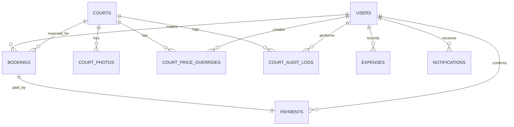

# LAPORAN ANALISIS SISTEM (SYSTEM ANALYSIS REPORT)
## Sistem Booking Online VITKA FUTSAL

| | |
|---|---|
| **Proyek** | Sistem Informasi Booking Futsal Online |
| **Klien** | VITKA FUTSAL |
| **Status** | Disetujui |
| **Dokumen** | Laporan Analisis Sistem (System Analysis Report) |
| **Tanggal** | 13 Juni 2026 |

---

## 1. Latar Belakang

VITKA FUTSAL adalah salah satu fasilitas penyedia lapangan olahraga futsal yang memiliki satu lokasi fisik dengan beberapa lapangan futsal. Saat ini, sistem operasional sewa lapangan di VITKA FUTSAL masih bertumpu pada pencatatan manual melalui aplikasi chat WhatsApp, panggilan telepon, atau pencatatan di buku besar. 

Proses manual ini menimbulkan beberapa kendala operasional yang signifikan:
- **Ketidakpastian Ketersediaan Slot**: Pelanggan harus terus-menerus menanyakan slot yang kosong kepada admin, yang memakan waktu lama dan tidak praktis.
- **Risiko Double Booking**: Kesalahan manusia (human error) dalam mencatat pemesanan sering kali mengakibatkan dua tim menyewa satu lapangan pada slot waktu yang sama.
- **Pencatatan Keuangan Tidak Terstruktur**: Transaksi pembayaran yang tercampur antara tunai dan transfer sulit direkapitulasi secara akurat setiap harinya.
- **Keterbatasan Visi Bisnis**: Pemilik (Owner) kesulitan memantau metrik bisnis penting, seperti okupansi harian lapangan dan detail profitabilitas bulanan, secara *real-time*.

Untuk mengatasi tantangan ini, diperlukan sebuah platform berbasis web mandiri (*self-service booking system*) yang mengotomatiskan proses pemesanan, mengamankan slot transaksi dari konflik bentrok waktu, dan menyediakan pencatatan keuangan yang transparan serta analitik bisnis bagi manajemen VITKA FUTSAL.

---

## 2. Tujuan Proyek

- **Otomatisasi Booking**: Menyediakan antarmuka kalender dan grid slot waktu visual yang memungkinkan pelanggan (baik yang terdaftar maupun guest) memesan lapangan secara mandiri 24/7.
- **Pencegahan Konflik Transaksi**: Mengamankan slot waktu sewa menggunakan mekanisme *Database Locking* agar tidak terjadi pemesanan ganda di waktu yang bersamaan.
- **Digitalisasi Laporan Keuangan**: Membantu admin mencatat seluruh pembayaran sewa lapangan (cash/transfer/QRIS) serta pencatatan pengeluaran (*expense*) operasional secara rapi di sistem.
- **Transparansi Executive**: Memberikan ringkasan laporan laba rugi (*revenue - expense = net profit*) dan grafik okupansi lapangan secara otomatis untuk Owner guna mempermudah pengambilan keputusan strategis.

---

## 3. Batasan Sistem (Scope Limitations)

Untuk menjamin kualitas dan penyelesaian proyek tepat waktu untuk presentasi/demo, berikut batasan ruang lingkup MVP:
1. **Single Location**: Aplikasi hanya mengelola 1 lokasi fisik VITKA FUTSAL dengan beberapa lapangan di dalamnya (bukan platform multi-cabang/multi-tenant).
2. **Manual Payment Verification**: Pembayaran dilakukan di luar sistem (manual di tempat via Cash, Transfer bank, atau QRIS dinamis/statis). Admin melakukan verifikasi pembayaran dan memilih metode bayar secara manual di sistem saat customer datang untuk mengubah status menjadi `Completed`.
3. **In-App Notification Only**: Notifikasi pengingat dan status booking hanya dikirimkan di dalam website (*in-app notification* menggunakan WebSocket Laravel Reverb secara real-time), tidak mengintegrasikan WhatsApp Gateway / Email Gateway pihak ketiga pada fase MVP.
4. **Read-Only Staff Management**: Owner hanya dapat melihat daftar staff (Admin) yang aktif mengelola sistem tanpa fitur modifikasi langsung (CRUD staff dilakukan langsung lewat database).

---

## 4. Analisis Permasalahan & Solusi

| Kategori | Deskripsi Permasalahan (AS-IS) | Solusi Sistem yang Ditawarkan (TO-BE) |
|---|---|---|
| **Conflict Slot** | Booking bentrok (double booking) karena admin salah mencatat jadwal sewa manual. | **Database Level Locking**: Menggunakan PostgreSQL *Advisory Lock* + `SELECT FOR UPDATE` saat pemesanan diproses untuk menjamin keamanan konkurensi data. |
| **Friction User** | Pelanggan malas mengunduh aplikasi atau mendaftar akun hanya untuk memesan lapangan sekali-sekali. | **Guest Booking**: Pelanggan dapat memesan lapangan tanpa akun hanya dengan nama & nomor HP. Mereka mendapatkan *Nomor Booking* unik untuk melacak status pesanan di halaman khusus. |
| **Kategori Uang** | Owner kesulitan memantau berapa pendapatan yang masuk lewat Cash, QRIS, atau Transfer Bank. | **Payment Categorization**: Admin wajib menginput metode pembayaran (Cash/Transfer/QRIS) saat konfirmasi pembayaran, menghasilkan laporan diagram lingkaran otomatis untuk Owner. |
| **Reschedule Chaos** | Pelanggan membatalkan atau mengubah jadwal secara sepihak via chat, membingungkan admin. | **Admin-Only Reschedule**: Modifikasi jadwal lapangan hanya diizinkan melalui panel Admin. Pelanggan harus menghubungi Admin untuk proses reschedule guna menjaga kontrol operasional. |
| **Financial Recaps** | Rekap pengeluaran operasional (kebersihan, listrik, jaring rusak) terpisah dan sering hilang. | **Expense Tracker**: Admin dapat menginput biaya pengeluaran operasional langsung ke sistem, yang langsung memotong total omset pendapatan menjadi Net Profit. |

---

## 5. Fitur-Fitur Utama Sistem

1. **Landing Page Interaktif**: Dilengkapi dengan Hero Section, Card Lapangan interaktif dengan tombol "Book Now", testimoni real, dan informasi footer.
2. **Booking Flow & Slot Grid**: Kalender pemesanan interaktif dengan visual slot hijau (tersedia), abu-abu (terisi), dan ungu (terpilih).
3. **Guest Tracking System**: Halaman publik untuk melacak status pemesanan (Confirmed / Completed / Cancelled) hanya dengan memasukkan Nomor Booking unik.
4. **Booking Management (Admin)**: Kontrol penuh untuk melihat list booking, reschedule slot, pembatalan booking dengan alasan wajib, dan penambahan booking manual (walk-in).
5. **Payment & Expense Management**: Pencatatan konfirmasi pembayaran, pengembalian uang (*refund*), penginputan pengeluaran operasional, serta download laporan laba rugi.
6. **Courts Control (Admin & Owner)**: Manajemen data lapangan (CRUD, durasi slot, jam operasional, harga flat, override harga per tanggal khusus, serta log audit perubahan lapangan).
7. **Executive Dashboard (Owner)**: Grafik analitik keuangan (laba bersih), distribusi metode bayar, persentase okupansi lapangan, serta download laporan PDF/Excel.
8. **Real-Time Notification**: Pengiriman notifikasi aktivitas sistem (booking baru, status bayar) secara instan menggunakan Laravel Reverb.

---

## 6. Role Bisnis & Otorisasi

Aplikasi memiliki **3 Peran Pengguna Utama**:

### 1. Customer (Pelanggan)
- **Guest Customer**: Dapat mengakses landing page, melakukan booking langsung, dan melacak status pesanan via nomor booking.
- **Registered Customer**: Memiliki akun terdaftar. Dapat melihat riwayat booking pribadi dan mengubah profil/password mereka sendiri.

### 2. Admin (Staf Operasional)
- Mengelola operasional harian: reschedule lapangan, verifikasi pembayaran manual, input pengeluaran harian, tambah booking manual (walk-in), dan menonaktifkan lapangan sementara jika terjadi kendala teknis.

### 3. Owner (Pemilik Fasilitas)
- Memiliki hak akses penuh Admin ditambah akses laporan keuangan eksekutif (Profit/Loss), analisis performa bulanan, daftar staff admin yang aktif, serta hak download laporan keuangan PDF/Excel.

---

## 7. Tabel CONTEXT Diagram

Context Diagram menggambarkan batas sistem dan aliran data antara entitas luar (*External Entity*) dengan Sistem Booking Online VITKA FUTSAL.

| Entitas Luar (External Entity) | Aliran Data Masuk ke Sistem (Input) | Aliran Data Keluar dari Sistem (Output) |
|---|---|---|
| **Pelanggan (Customer / Guest)** | 1. Permintaan daftar lapangan & ketersediaan slot<br>2. Data diri (Nama, No. HP, Email)<br>3. Pilihan tanggal & slot waktu booking<br>4. Pencarian status (Nomor Booking)<br>5. Perubahan data profil & password (Registered Only) | 1. Tampilan kalender & slot grid interaktif<br>2. Kode Nomor Booking unik (VF-XXXXXX)<br>3. Ringkasan biaya sewa<br>4. Notifikasi in-app (Status Booking & Pembayaran)<br>5. Riwayat pemesanan pribadi (Registered Only) |
| **Admin** | 1. Input booking manual (Walk-in)<br>2. Input pemindahan jadwal (Reschedule)<br>3. Input alasan pembatalan booking<br>4. Konfirmasi pembayaran & pemilihan metode bayar<br>5. Pencatatan pengeluaran operasional (Expense)<br>6. Modifikasi data lapangan (CRUD, status, jam buka, override harga)<br>7. Perubahan data profil & password | 1. List data booking & filter pencarian<br>2. Tampilan rekap transaksi pembayaran<br>3. Notifikasi real-time booking masuk<br>4. Rincian detail audit log lapangan<br>5. Dashboard admin (stats harian, heatmap jam sibuk) |
| **Owner** | 1. Parameter filter laporan keuangan (Periode Bulanan)<br>2. Perubahan data profil & password<br>*(Memiliki seluruh hak input Admin)* | 1. Dashboard analisis keuangan eksekutif (Profit/Loss)<br>2. File download laporan keuangan (PDF & Excel)<br>3. Laporan persentase okupansi lapangan & omset per lapangan<br>4. Daftar staf Admin yang aktif<br>*(Menerima seluruh hak output Admin)* |

---

## 8. Entity Relationship Diagram (ERD)

Berikut adalah struktur hubungan antar tabel database (PostgreSQL) yang dirancang secara optimal untuk mendukung fungsionalitas sistem tanpa redundansi data.

### Diagram Hubungan Entitas (Mermaid ERD)



### Kode DBML untuk dbdiagram.io

Berikut adalah kode DBML (Database Markup Language) yang siap disalin dan ditempel langsung ke [dbdiagram.io](https://dbdiagram.io) untuk memvisualisasikan ERD secara interaktif:

```dbml
Table users {
  id bigint [pk, increment]
  name varchar(255) [not null]
  email varchar(255) [unique, not null]
  phone varchar(20)
  password varchar(255) [not null]
  role varchar(20) [default: 'customer'] // 'owner', 'admin', 'customer'
  photo varchar(255)
  is_active boolean [default: true]
  remember_token varchar(100)
  created_at timestamp
  updated_at timestamp
}

Table courts {
  id bigint [pk, increment]
  name varchar(255) [not null]
  type varchar(20) [not null] // 'indoor', 'outdoor'
  price decimal(12,2) [not null]
  slot_duration integer [not null]
  open_time time [not null]
  close_time time [not null]
  status varchar(20) [default: 'active'] // 'active', 'inactive', 'maintenance'
  created_at timestamp
  updated_at timestamp
}

Table court_photos {
  id bigint [pk, increment]
  court_id bigint [not null]
  path varchar(255) [not null]
  sort_order integer [default: 0]
  created_at timestamp
}

Table court_price_overrides {
  id bigint [pk, increment]
  court_id bigint [not null]
  date date [not null]
  price decimal(12,2) [not null]
  note text
  created_by bigint
  created_at timestamp
}

Table court_audit_logs {
  id bigint [pk, increment]
  court_id bigint [not null]
  user_id bigint
  action varchar(50) [not null] // 'create', 'update', 'delete'
  field_name varchar(100)
  old_value text
  new_value text
  created_at timestamp
}

Table bookings {
  id bigint [pk, increment]
  booking_number varchar(20) [unique, not null]
  court_id bigint [not null]
  user_id bigint // NULL jika guest
  customer_name varchar(255) [not null]
  customer_phone varchar(20) [not null]
  customer_email varchar(255)
  date date [not null]
  start_time time [not null]
  end_time time [not null]
  total_price decimal(12,2) [not null]
  status varchar(20) [default: 'confirmed'] // 'confirmed', 'completed', 'cancelled'
  cancel_reason text
  cancelled_by bigint
  is_manual boolean [default: false]
  created_by bigint
  created_at timestamp
  updated_at timestamp
}

Table payments {
  id bigint [pk, increment]
  booking_id bigint [unique, not null]
  payment_method varchar(20) // 'cash', 'transfer', 'qris'
  amount decimal(12,2) [not null]
  refund_amount decimal(12,2) [default: 0]
  refund_reason text
  confirmed_by bigint
  confirmed_at timestamp
  created_at timestamp
  updated_at timestamp
}

Table expenses {
  id bigint [pk, increment]
  category varchar(100) [not null] // 'utilities', 'maintenance', 'salaries', 'other'
  description text
  amount decimal(12,2) [not null]
  expense_date date [not null]
  recorded_by bigint
  created_at timestamp
  updated_at timestamp
}

Table notifications {
  id bigint [pk, increment]
  user_id bigint [not null]
  title varchar(255) [not null]
  message text [not null]
  type varchar(50) // 'booking', 'payment', 'system'
  reference_id bigint
  reference_type varchar(50)
  is_read boolean [default: false]
  read_at timestamp
  created_at timestamp
}

Table testimonials {
  id bigint [pk, increment]
  customer_name varchar(255) [not null]
  avatar varchar(255)
  rating integer [not null] // 1-5
  content text [not null]
  is_active boolean [default: true]
  sort_order integer [default: 0]
  created_at timestamp
  updated_at timestamp
}

// Relasi Antar Tabel
Ref: court_photos.court_id > courts.id [delete: cascade]
Ref: court_price_overrides.court_id > courts.id [delete: cascade]
Ref: court_price_overrides.created_by > users.id
Ref: court_audit_logs.court_id > courts.id [delete: cascade]
Ref: court_audit_logs.user_id > users.id
Ref: bookings.court_id > courts.id
Ref: bookings.user_id > users.id
Ref: bookings.cancelled_by > users.id
Ref: bookings.created_by > users.id
Ref: payments.booking_id - bookings.id
Ref: payments.confirmed_by > users.id
Ref: expenses.recorded_by > users.id
Ref: notifications.user_id > users.id [delete: cascade]
```

### Kamus Data Tabel & Atribut

#### 1. Tabel: `users` (Data Pengguna)
- `id` (BIGINT, PK, Auto Increment)
- `name` (VARCHAR, NOT NULL)
- `email` (VARCHAR, UNIQUE, NOT NULL)
- `phone` (VARCHAR)
- `password` (VARCHAR, NOT NULL)
- `role` (VARCHAR, DEFAULT 'customer') ➔ 'owner', 'admin', 'customer'
- `photo` (VARCHAR, NULL) ➔ path foto profil
- `is_active` (BOOLEAN, DEFAULT true)
- `created_at` (TIMESTAMP)
- `updated_at` (TIMESTAMP)

#### 2. Tabel: `courts` (Data Lapangan Futsal)
- `id` (BIGINT, PK, Auto Increment)
- `name` (VARCHAR, NOT NULL)
- `type` (VARCHAR) ➔ 'indoor', 'outdoor'
- `price` (DECIMAL(12,2), NOT NULL) ➔ harga flat default per slot
- `slot_duration` (INTEGER, NOT NULL) ➔ durasi sewa dalam menit (misal: 60)
- `open_time` (TIME, NOT NULL) ➔ jam operasional buka
- `close_time` (TIME, NOT NULL) ➔ jam operasional tutup
- `status` (VARCHAR, DEFAULT 'active') ➔ 'active', 'inactive', 'maintenance'
- `created_at` (TIMESTAMP)
- `updated_at` (TIMESTAMP)

#### 3. Tabel: `court_photos` (Foto Lapangan)
- `id` (BIGINT, PK, Auto Increment)
- `court_id` (BIGINT, FK -> courts.id, Cascade Delete)
- `path` (VARCHAR, NOT NULL) ➔ path file gambar
- `sort_order` (INTEGER, DEFAULT 0)
- `created_at` (TIMESTAMP)

#### 4. Tabel: `court_price_overrides` (Override Harga Khusus)
- `id` (BIGINT, PK, Auto Increment)
- `court_id` (BIGINT, FK -> courts.id, Cascade Delete)
- `date` (DATE, NOT NULL) ➔ tanggal spesifik harga berubah
- `price` (DECIMAL(12,2), NOT NULL) ➔ harga sewa khusus
- `note` (TEXT) ➔ alasan override (misal: Hari Libur Nasional)
- `created_by` (BIGINT, FK -> users.id)
- `created_at` (TIMESTAMP)
- *Constraint*: UNIQUE(court_id, date)

#### 5. Tabel: `court_audit_logs` (Audit Log Perubahan Lapangan)
- `id` (BIGINT, PK, Auto Increment)
- `court_id` (BIGINT, FK -> courts.id, Cascade Delete)
- `user_id` (BIGINT, FK -> users.id)
- `action` (VARCHAR) ➔ 'create', 'update', 'delete'
- `field_name` (VARCHAR) ➔ nama kolom yang dirubah
- `old_value` (TEXT, NULL)
- `new_value` (TEXT, NULL)
- `created_at` (TIMESTAMP)

#### 6. Tabel: `bookings` (Transaksi Sewa Lapangan)
- `id` (BIGINT, PK, Auto Increment)
- `booking_number` (VARCHAR, UNIQUE, NOT NULL) ➔ format: VF-XXXXXX (6 karakter unik)
- `court_id` (BIGINT, FK -> courts.id)
- `user_id` (BIGINT, FK -> users.id, NULL) ➔ NULL jika guest booking
- `customer_name` (VARCHAR, NOT NULL)
- `customer_phone` (VARCHAR, NOT NULL)
- `customer_email` (VARCHAR, NULL)
- `date` (DATE, NOT NULL) ➔ tanggal sewa
- `start_time` (TIME, NOT NULL) ➔ jam mulai sewa
- `end_time` (TIME, NOT NULL) ➔ jam selesai sewa
- `total_price` (DECIMAL(12,2), NOT NULL) ➔ harga final saat dibooking (immutable)
- `status` (VARCHAR, DEFAULT 'confirmed') ➔ 'confirmed', 'completed', 'cancelled'
- `cancel_reason` (TEXT, NULL) ➔ alasan pembatalan
- `cancelled_by` (BIGINT, FK -> users.id, NULL)
- `is_manual` (BOOLEAN, DEFAULT false) ➔ true jika diinput admin via walk-in
- `created_by` (BIGINT, FK -> users.id, NULL) ➔ admin jika manual
- `created_at` (TIMESTAMP)
- `updated_at` (TIMESTAMP)
- *Indexes*: `idx_bookings_court_date` (court_id, date), `idx_bookings_number` (booking_number)

#### 7. Tabel: `payments` (Detail Pembayaran Keuangan)
- `id` (BIGINT, PK, Auto Increment)
- `booking_id` (BIGINT, UNIQUE, FK -> bookings.id)
- `payment_method` (VARCHAR) ➔ 'cash', 'transfer', 'qris'
- `amount` (DECIMAL(12,2), NOT NULL) ➔ jumlah dibayarkan
- `refund_amount` (DECIMAL(12,2), DEFAULT 0)
- `refund_reason` (TEXT, NULL)
- `confirmed_by` (BIGINT, FK -> users.id) ➔ admin yang verifikasi
- `confirmed_at` (TIMESTAMP)
- `created_at` (TIMESTAMP)
- `updated_at` (TIMESTAMP)

#### 8. Tabel: `expenses` (Data Pengeluaran Operasional)
- `id` (BIGINT, PK, Auto Increment)
- `category` (VARCHAR, NOT NULL) ➔ 'utilities', 'maintenance', 'salaries', 'other'
- `description` (TEXT) ➔ rincian biaya
- `amount` (DECIMAL(12,2), NOT NULL) ➔ jumlah pengeluaran
- `expense_date` (DATE, NOT NULL) ➔ tanggal transaksi pengeluaran
- `recorded_by` (BIGINT, FK -> users.id) ➔ admin/owner yang mencatat
- `created_at` (TIMESTAMP)
- `updated_at` (TIMESTAMP)

#### 9. Tabel: `notifications` (Notifikasi In-App)
- `id` (BIGINT, PK, Auto Increment)
- `user_id` (BIGINT, FK -> users.id, Cascade Delete)
- `title` (VARCHAR, NOT NULL)
- `message` (TEXT, NOT NULL)
- `type` (VARCHAR) ➔ 'booking', 'payment', 'system'
- `reference_id` (BIGINT) ➔ id record terkait (misal id booking)
- `reference_type` (VARCHAR) ➔ 'booking', 'payment'
- `is_read` (BOOLEAN, DEFAULT false)
- `read_at` (TIMESTAMP, NULL)
- `created_at` (TIMESTAMP)

#### 10. Tabel: `testimonials` (Manajemen Testimoni Landing Page)
- `id` (BIGINT, PK, Auto Increment)
- `customer_name` (VARCHAR, NOT NULL)
- `avatar` (VARCHAR, NULL)
- `rating` (INTEGER, NOT NULL) ➔ skala 1-5
- `content` (TEXT, NOT NULL)
- `is_active` (BOOLEAN, DEFAULT true)
- `sort_order` (INTEGER, DEFAULT 0)
- `created_at` (TIMESTAMP)
- `updated_at` (TIMESTAMP)

---

## 9. Spesifikasi Tech Stack

Aplikasi ini menggunakan pendekatan **Monolitik Modern** untuk performa tinggi, proses development cepat, dan kemudahan dalam pemeliharaan server.

- **Backend Framework**: Laravel 12 (PHP 8.3+)
  - *Alasan*: Framework stabil, rilis terbaru, memiliki ekosistem yang matang untuk penanganan antrian, database locking, dan integrasi frontend.
- **Frontend Framework**: Vue.js 3 (Composition API)
  - *Alasan*: Interaksi kalender dan grid slot bersifat dinamis, membutuhkan reaktivitas tinggi untuk kenyamanan UX customer.
- **CSS Framework**: TailwindCSS v4
  - *Alasan*: Performa tinggi, konfigurasi berbasis CSS-first (`@theme` di CSS) yang terintegrasi native dengan Laravel 12 & Vite.
- **UI Library**: PrimeVue v4 (Styled Mode, Aura Preset)
  - *Alasan*: Komponen lengkap (Calendar, Dialog, DataTables) yang mempermudah pembentukan antarmuka yang kompleks dengan cepat dengan kustomisasi via CSS variables.
- **Icon Library**: Lucide Vue Next
  - *Alasan*: Ikon berbasis SVG yang modern, ringan, bergaris tipis (*stroke*), sangat bersih dan seragam.
- **Animation Library**: GSAP / Motion One
  - *Alasan*: Animasi mikro yang halus, transisi grid yang responsif, dan reveal entrance yang premium untuk pengalaman brutalist editorial.
- **Glue (Penghubung)**: Inertia.js
  - *Alasan*: Menghubungkan Laravel dan Vue tanpa perlu membuat REST API terpisah, mempercepat development dengan tetap mendapatkan pengalaman SPA (Single Page Application).
- **Database Engine**: PostgreSQL
  - *Alasan*: Mendukung tipe data waktu/time range dengan sangat baik, integritas relasional tinggi, dan mendukung advisory locks.
- **Real-Time Communication**: Laravel Reverb (WebSocket)
  - *Alasan*: Broadcast notifikasi real-time dari backend ke Vue secara instan tanpa perlu polling HTTP request berulang kali.
- **Document Export Engine**: Maatwebsite Excel & DomPDF (Laravel)
  - *Alasan*: Library standard industri untuk mencetak struk sewa (PDF) dan laporan profit bulanan (Excel).

---

## 10. Rangkuman & Kesimpulan Analisis

Sistem Booking Online VITKA FUTSAL dirancang untuk memecahkan kendala klasik pengelolaan fasilitas olahraga sewa lapangan (bentrok slot, rekap uang manual, ketiadaan laporan visual). Dengan bertumpu pada **Light Theme brutalist (Hazard White background)** yang bersih dan bertenaga, aplikasi mengedepankan fungsionalitas dan keterbacaan tingkat tinggi (*utility-first*).

Secara arsitektur, penerapan **Service Repository Pattern** di backend memisahkan business logic (termasuk pengamanan transaksi dengan database locking) agar kode terstruktur, mudah dites, dan aman dari kegagalan race condition. Di sisi frontend, perpaduan **TailwindCSS v4**, **PrimeVue v4**, dan **Lucide Vue Next** diorganisasikan dalam **Feature-based component architecture** menjaga kerapihan komponen reaktif Vue agar mudah dipelihara.

Dokumen analisis ini telah disinkronkan sepenuhnya dengan seluruh fungsionalitas PRD dan skema database, siap digunakan sebagai cetak biru (*blueprint*) mutlak tim developer untuk memulai pengembangan sistem.
